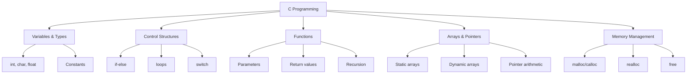

# C Programming Essentials 📘


## 🚀 Quick Start Guide

### Hello World Program
```c
#include <stdio.h>

int main() {
    printf("Hello, World!\n");
    return 0;
}
```

**Compile & Run:**
```bash
gcc hello.c -o hello
./hello
```

## 📋 Core Topics Overview

### 1. **Basic Syntax & Structure**
```c
#include <stdio.h>  // Header file

int main() {        // Entry point
    // Variables
    int age = 25;
    float salary = 50000.50;
    char grade = 'A';
    
    // Output
    printf("Age: %d\nSalary: %.2f\nGrade: %c\n", age, salary, grade);
    
    return 0;  // Exit code
}
```

### 2. **Data Types**
| Type | Size | Range | Example |
|------|------|-------|---------|
| `char` | 1 byte | -128 to 127 | `char c = 'A';` |
| `int` | 4 bytes | -2³¹ to 2³¹-1 | `int num = 100;` |
| `float` | 4 bytes | 1.2E-38 to 3.4E+38 | `float pi = 3.14;` |
| `double` | 8 bytes | 2.3E-308 to 1.7E+308 | `double val = 3.14159;` |

### 3. **Control Flow**
```c
// If-else
if (age >= 18) {
    printf("Adult\n");
} else {
    printf("Minor\n");
}

// Switch
switch(grade) {
    case 'A': printf("Excellent\n"); break;
    case 'B': printf("Good\n"); break;
    default: printf("Try again\n");
}

// Loops
for(int i=0; i<5; i++) printf("%d ", i);  // 0 1 2 3 4

while(count > 0) {
    count--;
}

do {
    // runs at least once
} while(condition);
```

### 4. **Functions**
```c
// Function prototype
int add(int a, int b);

// Function definition
int add(int a, int b) {
    return a + b;
}

// Function call
int result = add(10, 20);
```

### 5. **Arrays & Strings**
```c
// Arrays
int numbers[5] = {1, 2, 3, 4, 5};
numbers[0] = 10;  // Access/modify

// 2D Arrays
int matrix[3][3] = {{1,2,3}, {4,5,6}, {7,8,9}};

// Strings
char name[20] = "John";
char name2[] = "Doe";  // Auto size
strcpy(name, "Jane");  // Copy string
strlen(name);          // Get length
```

### 6. **Pointers (Most Important!)**
```c
int var = 10;
int *ptr = &var;  // ptr points to var

printf("Value: %d\n", var);      // 10
printf("Address: %p\n", &var);   // Memory address
printf("Pointer: %d\n", *ptr);   // 10 (dereference)

// Pointer arithmetic
int arr[] = {10, 20, 30};
int *p = arr;
printf("%d\n", *(p+1));  // 20

// Pointers in functions
void swap(int *a, int *b) {
    int temp = *a;
    *a = *b;
    *b = temp;
}
```

### 7. **Structures**
```c
struct Student {
    char name[50];
    int age;
    float marks;
};

// Create variable
struct Student s1;
strcpy(s1.name, "Alice");
s1.age = 20;
s1.marks = 85.5;

// Pointer to structure
struct Student *ptr = &s1;
printf("Name: %s\n", ptr->name);  // Arrow operator
```

### 8. **Memory Management**
```c
#include <stdlib.h>

// Dynamic allocation
int *arr = (int*)malloc(5 * sizeof(int));
if(arr == NULL) {
    printf("Memory error!\n");
    return 1;
}

// Initialize array
for(int i=0; i<5; i++) arr[i] = i*10;

// Reallocate
arr = realloc(arr, 10 * sizeof(int));

// FREE MEMORY (IMPORTANT!)
free(arr);
arr = NULL;
```

### 9. **File Handling**
```c
#include <stdio.h>

// Write to file
FILE *f = fopen("data.txt", "w");
fprintf(f, "Hello File!\n");
fclose(f);

// Read from file
f = fopen("data.txt", "r");
char buffer[100];
while(fgets(buffer, sizeof(buffer), f) != NULL) {
    printf("%s", buffer);
}
fclose(f);
```

## 🔑 Key Concepts Diagram



## ⚠️ Common Pitfalls

1. **Forgetting to free memory** → Memory leaks
2. **Array out of bounds** → Undefined behavior
3. **Using uninitialized pointers** → Segmentation fault
4. **Missing break in switch** → Fall-through
5. **Not checking malloc return** → Crash if out of memory

## 💡 Best Practices

### Code Style
```c
// GOOD: Clear naming, consistent indentation
int calculate_average(int *scores, int count) {
    if (count <= 0) return 0;
    
    int total = 0;
    for (int i = 0; i < count; i++) {
        total += scores[i];
    }
    return total / count;
}

// BAD: Cryptic names, no spacing
int calc(int*a,int n){int t=0;for(int i=0;i<n;i++)t+=a[i];return t/n;}
```

### Memory Safety
```c
// Always check allocations
int *ptr = malloc(size * sizeof(int));
if (ptr == NULL) {
    // Handle error
    fprintf(stderr, "Memory allocation failed\n");
    exit(EXIT_FAILURE);
}

// Free and nullify
free(ptr);
ptr = NULL;  // Prevent dangling pointer
```

## 📊 Quick Reference Table

| Topic | Syntax Example | Purpose |
|-------|---------------|---------|
| Variable | `int x = 10;` | Store data |
| Array | `int arr[5];` | Store multiple values |
| Pointer | `int *p = &x;` | Store memory address |
| Function | `int add(int a, int b)` | Reusable code block |
| Struct | `struct Point {int x,y;};` | Group related data |
| File I/O | `FILE *f = fopen(...)` | Read/write files |

## 🚀 Next Steps

1. **Practice** with simple programs
2. **Understand pointers** thoroughly
3. **Learn debugging** with gdb
4. **Explore standard library**
5. **Build a small project** (calculator, file manager, etc.)

## 📚 Essential Header Files

- `stdio.h` - Input/Output functions
- `stdlib.h` - Memory allocation, conversions
- `string.h` - String manipulation
- `math.h` - Mathematical functions
- `time.h` - Date and time functions

## 🔧 Compiler Flags (GCC)

```bash
# Basic compilation
gcc program.c -o program

# With warnings (RECOMMENDED)
gcc -Wall -Wextra -Werror program.c -o program

# Debug information
gcc -g program.c -o program

# Optimization
gcc -O2 program.c -o program

# Include paths
gcc -I/path/to/headers program.c -o program
```

---
**Remember**: C gives you power but also responsibility. Always validate inputs, check memory allocations, and write clear, maintainable code!

*Happy Coding! 🎯*
